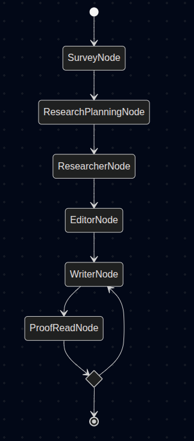
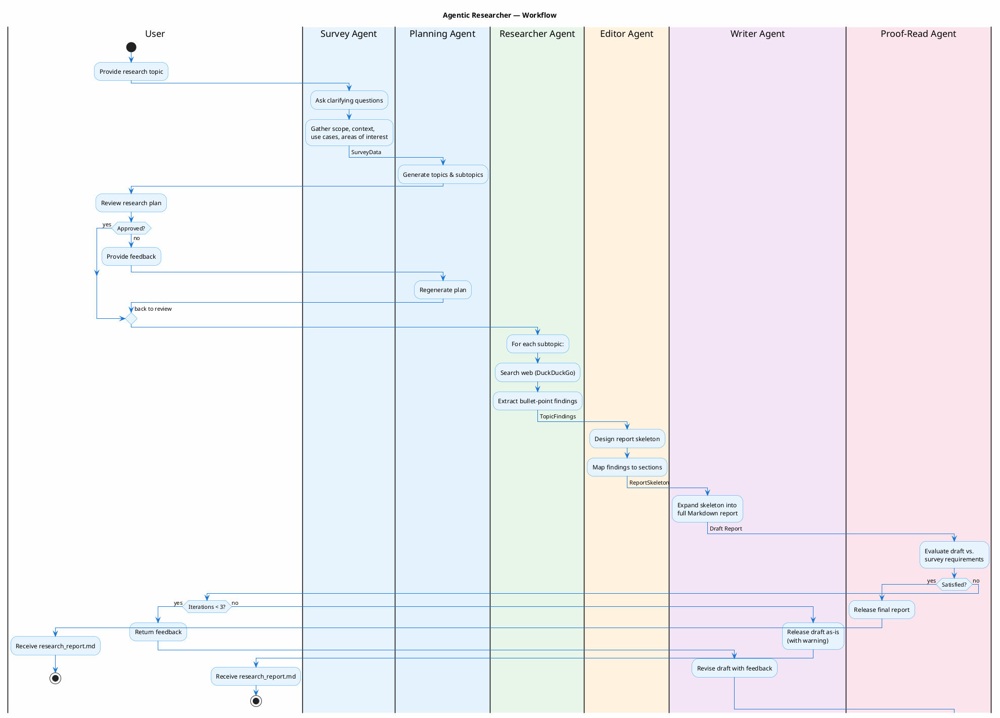

# Agentic Researcher

A multi-agent, AI-driven technical research workflow that produces comprehensive Markdown reports. Built with [pydantic-ai](https://ai.pydantic.dev/) for agent orchestration and [pydantic-graph](https://ai.pydantic.dev/graph/) for workflow management, powered by Google Gemini LLMs.

---

## Introduction

**Agentic Researcher** automates the end-to-end process of producing a detailed technical research report on any user-specified topic. Rather than relying on a single monolithic prompt, the system decomposes the task into six specialised agents — each with a clearly defined responsibility — that collaborate through a directed graph workflow.

The user interacts with the system through a CLI. They provide a research topic, answer clarifying questions, review and approve a research plan, and receive a polished Markdown report as output. The entire pipeline — from requirements gathering to final proof-reading — runs autonomously once the research plan is approved, including iterative revision cycles to improve quality.

### Key Features

- **Conversational requirements gathering** — the Survey Agent asks targeted questions to understand scope, context, and areas of interest.
- **Structured research planning** — topics and subtopics are generated and presented for user approval before any research begins.
- **Web-augmented research** — the Researcher Agent searches the web via DuckDuckGo to gather factual, up-to-date information.
- **Iterative quality refinement** — the Writer and Proof-Reader agents loop up to 3 revision cycles to ensure the report meets the original requirements.
- **Structured logging** — uses [Loguru](https://github.com/Delgan/loguru) for clear, emoji-annotated progress tracking throughout the pipeline.

---

## Implementation

### Architecture Overview

The workflow is orchestrated as a **pydantic-graph** `Graph`, where each node wraps a **pydantic-ai** `Agent`. A shared `ResearchState` (Pydantic model) flows through the graph, accumulating data at each stage. A `ResearchDeps` dependency object carries configuration (model name, API key, output path) across all nodes.

```
src/agentic_researcher/
├── agents/
│   ├── survey.py          # Survey Agent
│   ├── planning.py        # Research Planning Agent
│   ├── researcher.py      # Researcher Agent
│   ├── editor.py          # Editor Agent
│   ├── writer.py          # Writer Agent
│   └── proofreader.py     # Proof-Read Agent
├── utils/
│   ├── search.py          # DuckDuckGo web search utility and tavily search
│   └── file_utils.py      # file util
├── state.py               # Pydantic state & data models
├── deps.py                # Dependency injection & model factory
├── graph.py               # Graph node definitions & wiring
└── cli.py                 # CLI entry point
```

---

### Agents

#### 1. Survey Agent (`SurveyNode`)

**Responsibility:** Interactively gathers the research topic and requirements from the user through a conversational loop.

- Asks one question at a time to understand the topic, scope, context, use cases, and areas of particular interest.
- Maintains conversation history across turns so the LLM can build on previous answers.
- Terminates when all fields of the `SurveyData` model are populated, producing a structured requirements object.

**Output model:** `SurveyData` (topic, scope, context, use_case, areas_of_interest, additional_notes)

---

#### 2. Research Planning Agent (`ResearchPlanningNode`)

**Responsibility:** Generates a structured research plan consisting of topics and subtopics based on the survey requirements.

- Produces a hierarchical plan ensuring breadth of coverage across the research domain.
- Presents the plan to the user for review — the user can approve or provide feedback for regeneration.
- Supports multiple iteration cycles, incorporating user feedback each time.

**Output model:** `ResearchPlan` (list of `TopicPlan`, each containing a list of `Subtopic`)

---

#### 3. Researcher Agent (`ResearcherNode`)

**Responsibility:** Executes web research for each subtopic in the approved plan, extracting factual findings.

- Iterates over every topic and subtopic in the plan.
- Uses a `search_web` tool backed by DuckDuckGo Lite to retrieve relevant web pages.
- Synthesises search results into concise, bullet-point findings with source references.
- Falls back to the LLM's parametric knowledge when web search returns no results.

**Output model:** `SubtopicFindings` (subtopic_name, findings, sources) — aggregated into `TopicFindings` per topic.

---

#### 4. Editor Agent (`EditorNode`)

**Responsibility:** Designs the structural skeleton of the research report.

- Consumes the survey requirements, research plan, and all gathered findings.
- Organises content into a hierarchical outline with multi-level headings (H1, H2, H3).
- Maps bullet-point findings to the appropriate sections — does not write prose, only structures.

**Output model:** `ReportSkeleton` (title, list of `ReportSkeletonSection` with nested subsections)

---

#### 5. Writer Agent (`WriterNode`)

**Responsibility:** Expands the report skeleton into a full-length technical report in Markdown.

- Transforms bullet-point findings into cohesive, well-structured paragraphs.
- Preserves all technical details, facts, and source references from the research.
- On revision cycles, incorporates proof-reader feedback to improve the draft.

**Output model:** `str` (complete Markdown report)

---

#### 6. Proof-Read Agent (`ProofReadNode`)

**Responsibility:** Evaluates the draft report against the original survey requirements.

- Checks for comprehensiveness, technical accuracy, coverage of requested areas, and formatting quality.
- If satisfied, releases the report to the output file and ends the workflow.
- If not satisfied, returns concrete, actionable feedback and triggers another Writer → Proof-Read cycle (up to 3 iterations max).

**Output model:** `ProofreadResult` (satisfied: bool, feedback: list[str])

---

### Workflow Diagram





---

## Developers

### Prerequisites

- **Python 3.11+**
- **[uv](https://docs.astral.sh/uv/)** — fast Python package manager

### Setup

```bash
# Clone the repository
git clone <repo-url>
cd agentic_researcher

# Create the virtual environment and install all dependencies
uv sync
```

### Environment Configuration

Create a `.env` file in the project root:

```dotenv
GEMINI_API_KEY=your-google-gemini-api-key
RESEARCH_MODEL=gemini-2.5-flash-lite   # optional, overrides the default model
TAVILY_API_KEY=your-tavily-api-key

```

| Variable | Required | Description |
|----------|----------|-------------|
| `GEMINI_API_KEY` | Yes | Google Gemini API key (also accepts `GOOGLE_API_KEY`) |
| `RESEARCH_MODEL` | No | Gemini model name to use (default: `gemini-2.5-flash-lite`) |
| `TAVILY_API_KEY` | No | API key for tavily search |

### Running the Workflow

```bash
# Run the interactive research workflow
uv run --env-file .env -m agentic_researcher.cli

# Or with poethepoet (if installed)
poe run-research
```

#### CLI Options

```
--model   Google Gemini model name (default: from RESEARCH_MODEL env or gemini-2.5-flash-lite)
--output  Output markdown file path (default: research_report.md)
```

Example with custom options:

```bash
uv run --env-file .env -m agentic_researcher.cli --model gemini-2.5-flash --output output/my_report.md
```

### Running Tests

```bash
uv run pytest -s

# Or with poethepoet
poe test
```

### Project Dependencies

| Package | Purpose |
|---------|---------|
| `pydantic-ai` | Agent framework — LLM interaction, structured output, tool registration |
| `pydantic-graph` | Graph-based workflow orchestration |
| `pydantic` | Data validation and state schema definitions |
| `loguru` | Structured, human-readable logging |

---
